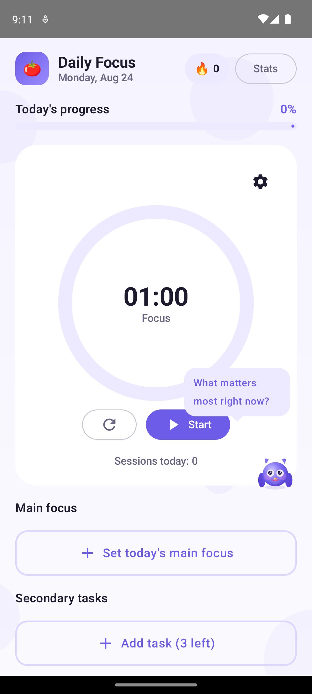
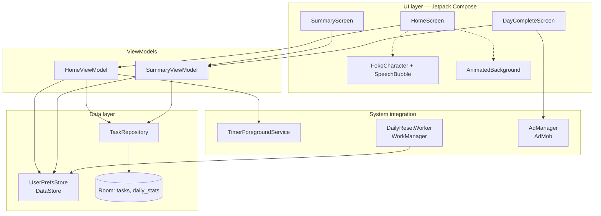
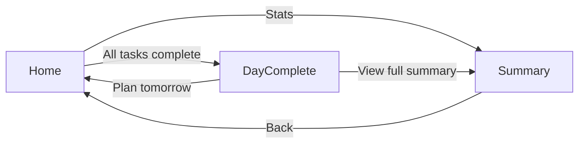
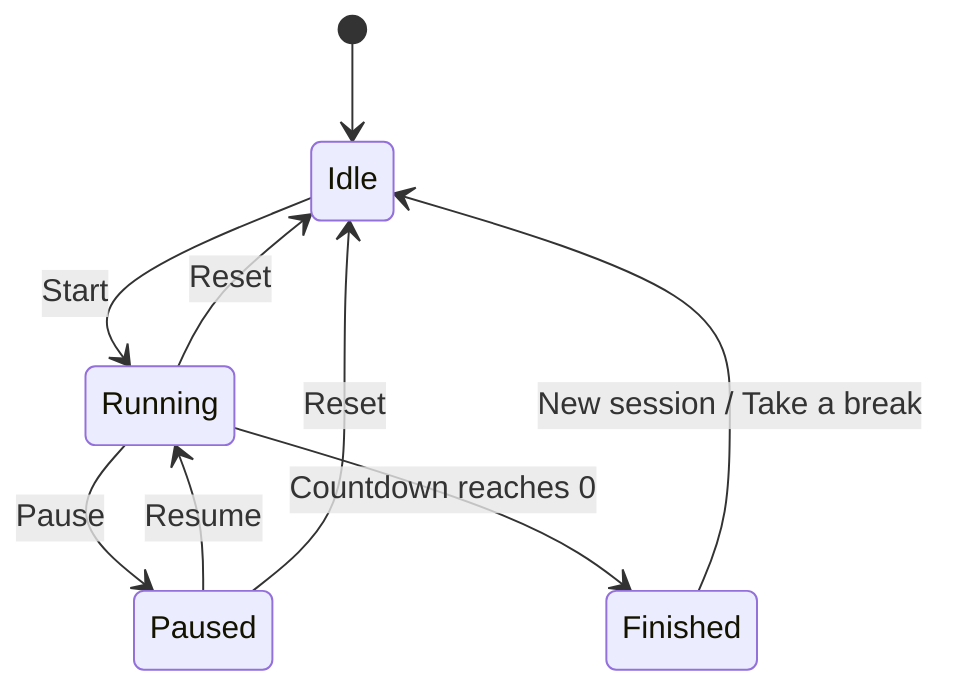
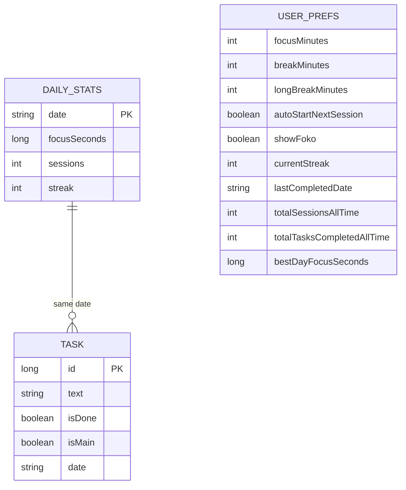

# Daily Focus

> Stop managing 50 tasks. Focus on what matters.

A minimalist Pomodoro-based productivity app for Android. Pick **one** main task a day, up to three secondary ones, and use a built-in focus timer to actually get them done. Built with Kotlin, Jetpack Compose, and Material 3.

<p align="center">
  
  
</p>

## Features

- **One main focus + up to 3 secondary tasks** per day — deliberately limited scope
- **Pomodoro timer** with customizable focus/break durations, presets, and custom minutes
- **Long-break cadence** — every 4th focus session automatically offers a longer break
- **Auto-start** — optionally chain focus → break → focus without tapping Start each time
- **Streaks and achievements** — daily streak tracking, weekly focus chart, unlockable milestones
- **Foko** — a small Canvas-drawn owl companion with 6 moods and contextual encouragement, entirely optional (toggle in Settings)
- **Subtle animated background** — low-opacity drifting blobs that respect reduced-motion settings
- **Home screen timer survives backgrounding** via a foreground service with a live countdown notification
- **Daily reset + reminder** via WorkManager
- **Dark mode**, auto-detected from system theme
- **Localized** into English, German, Spanish, and French
- AdMob banner (Home) and interstitial (Day Complete) ad slots, wired with test ad units

## Screens

| Home | Summary | Day Complete |
|---|---|---|
| Timer, today's tasks, streak badge | Completion ring, weekly chart, achievements | Trophy, confetti, session recap |

## Tech stack

- **UI:** Jetpack Compose, Material 3, Navigation Compose
- **Architecture:** MVVM + repository pattern, `StateFlow`-driven UI state
- **Persistence:** Room (tasks, daily stats), DataStore Preferences (settings, streak, all-time totals)
- **Background work:** WorkManager (daily reset/reminder), a foreground `Service` (live timer notification)
- **Ads:** Google Mobile Ads SDK (AdMob), test ad units
- **DI:** manual constructor injection via a small `Application`-level container (no framework)

## Architecture



## Navigation



## Timer state machine



Each cycle also tracks a `mode` (`FOCUS` or `BREAK`) independently of the status above. Finishing a focus session persists the session to `DailyStats`, increments the all-time session count, and — every 4th session — flags the next break as a **long break**. If "Auto-start next session" is enabled, `Finished` transitions straight back into `Running` in the other mode instead of waiting at `Idle`.

## Data model



`Task` and `DailyStats` live in Room, keyed by an ISO `date` string rather than a foreign key. `UserPrefs` is a single DataStore-backed record — no per-day rows, since it holds settings and running totals rather than daily history.

## Foko

Foko is drawn entirely with Compose `Canvas` (no bitmaps), so it scales cleanly across its three placements — 48dp on Home, 36dp on Summary, 72dp on Day Complete. Its mood is derived from live app state, not set manually:

| State | Color | Trigger |
|---|---|---|
| Idle | Purple | Default — no timer running |
| Focusing | Orange | A focus session is running or paused |
| Task Complete | Green | Briefly, right after any task is checked off |
| Break Time | Blue | A break is running |
| Celebrating | Gold | All of today's tasks are done |
| Streak Alert | Pink | Briefly, on hitting a 3/7/14/30-day streak |

A speech bubble above Foko surfaces short, randomized, context-aware messages (new task, session started, encouragement every 10 minutes, task completed, break started, streak milestones, etc.), pulled from localized string arrays so they translate along with the rest of the UI.

## Project structure

```
app/src/main/java/com/myday/dailyfocus/
├── MainActivity.kt
├── DailyFocusApp.kt                 # NavHost
├── DailyFocusApplication.kt         # DI container, WorkManager config
├── ads/
│   └── AdManager.kt                 # Interstitial + BannerAdView
├── data/
│   ├── db/                          # Room: AppDatabase, TaskDao, DailyStatsDao
│   ├── model/                       # Task, DailyStats
│   ├── prefs/                       # UserPrefsStore (DataStore)
│   └── repository/                  # TaskRepository
├── service/
│   ├── DailyResetWorker.kt          # WorkManager: streak reset + daily reminder
│   └── TimerForegroundService.kt    # Live countdown notification
└── ui/
    ├── theme/                       # Color, Theme, Type
    ├── components/                  # TimerRing, TaskCard, StatCard, WeekChart,
    │                                 #   AchievementCard, AnimatedBackground
    │   └── foko/                    # FokoCharacter, FokoState, FokoAnimations,
    │                                 #   SpeechBubble, FokoMessages
    ├── home/                        # HomeScreen, HomeViewModel
    ├── summary/                     # SummaryScreen, SummaryViewModel
    └── daycomplete/                 # DayCompleteScreen
```

## Building

```bash
./gradlew :app:assembleDebug
./gradlew :app:installDebug
```

Requires JDK 17+ and the Android SDK (compileSdk 37). The AdMob app ID and ad unit IDs in `AndroidManifest.xml` / `AdManager.kt` are Google's public **test IDs** — swap them for real ones before shipping.

## Localization

UI strings live in `res/values/strings.xml` with translations in `values-de`, `values-es`, and `values-fr`. Android picks the matching locale automatically from the device's system language, falling back to English.

## License

[MIT](LICENSE)
